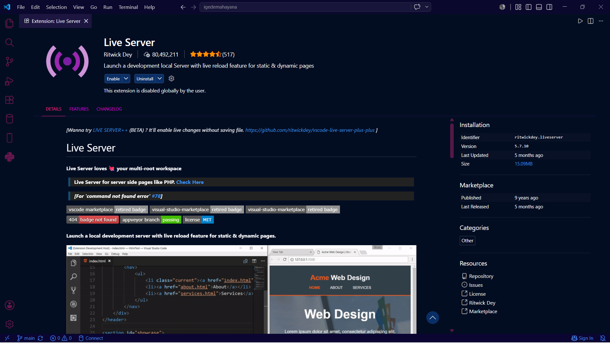
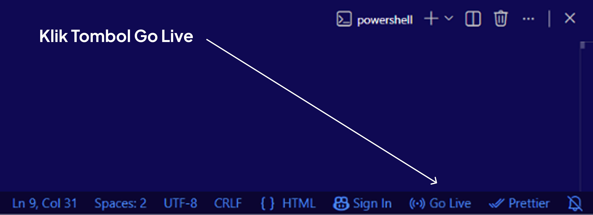

# Judul Website: Website Roadmap Web Developer

### Website

<p align="center">
  
</p>

## Teknologi yang digunakan

1. Figma
2. HTML
3. Tailwind
4. JavaScript

## Cara Menjalankan Project Myatech.id

### 1. Clone Repository

Clone Repository Myanastudy:

```bash
git clone https://github.com/igedemahayana/roadmap-web-developer.git
```

### 2. Buka Project di IDE

Buka menggunakan Visual Studio Code

### 3. Install Extension Live Server

Jika menggunakan Visual Studio Code:

1. Buka menu Extensions (CTRL + Shift + X)
2. Cari Live Server
3. Install extension tersebut

<p align="center">
  
</p>

### 4. Jalankan Website

Setelah extension terinstall:

Klik tombol “Go Live” di pojok kanan bawah Visual Studio Code

<p align="center">
  
</p>

### 5. Website Berhasil Dijalankan

Setelah berhasil, website akan otomatis terbuka di browser.
